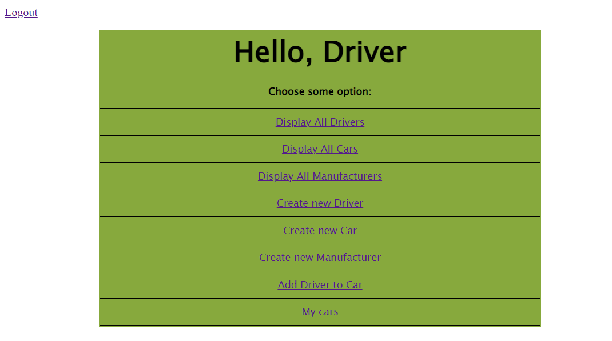
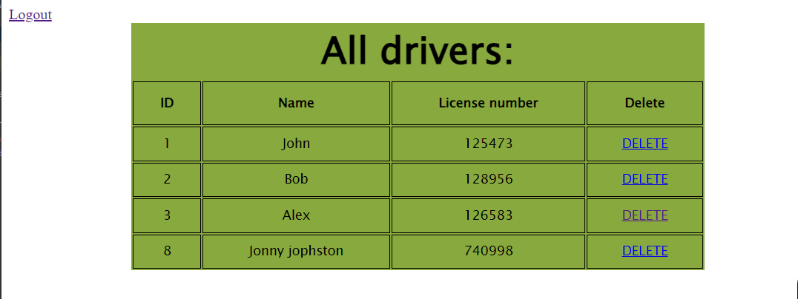

<h1 align="center">
  🚕 Taxi Service 🚕
</h1>

  <a href="#description">Description</a> •
  <a href="#screenshots">Screenshots</a> •
  <a href="#program-functionality">Program functionality</a> •
  <a href="#architecture">Architecture</a> •
  <a href="#technologies">Technologies</a> •
  <a href="#how-to-start-the-program">How to start the program</a> •

## 📃Description
This is a simple web application for working with a taxi service. It supports authentication, registration and CRUD operations.
The program is written according to SOLID principles, Dependency Injection design pattern and REST rules.

## 📷Screenshots
### Home screen

### All drivers screen

## ⚙Program functionality
* register as a driver;
* login as driver;
* create/update/delete a driver;
* display all drivers
* create/update/delete a car;
* display all cars;
* create/update/delete a manufacturer;
* display all manufacturers;
* add a driver to a car;
* display all cars for current login driver;

## 🔧Architecture
|       3-layer architecture       |
|:--------------------------------:|
| Controllers (Presentation layer) |
|   Services (Application layer)   |
|     DAO (Data access layer)      |
## 🎯Technologies
* Tomcat 9.0.50
* Maven 3.1.1
* MySQL 8.0.22
* JDBC
* Java 11
* JSP
* JSTL 1.2
* Servlet Api 4.0.1
## 🔨How to start the program
1. Fork this project to your repository
2. Press "Code" and choose HTTPS or SSH URL to clone the project
3. Install MySQL
4. Copy and run SQL script from resources/init_db.sql in order to create a schema and tables for the project
5. Configure Apache Tomcat version: 9.0.50
6. Configure /util/ConnectionUtil.java with your own URL, username, password and JDBC driver
7. Run the project
